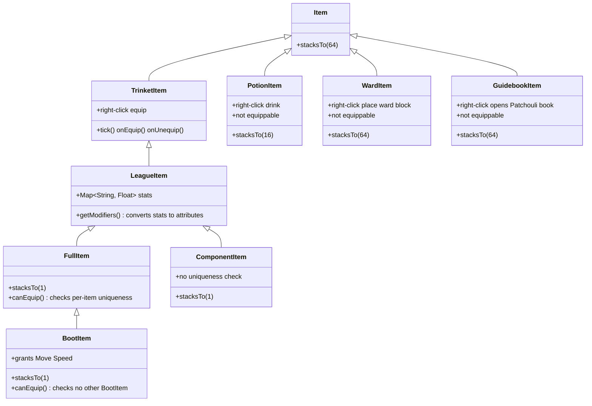

# league-of-crafters

> **Note:** Ward block textures are temporary. Wards use the item texture as a sapling-style cross block model. These will be replaced with dedicated block textures in a future update.

## Items

| Item | Status | Stat Slug |
|------|--------|-----------|
| Abyssal Mask | Partially Implemented | `abyssal_mask` |
| Actualizer | Partially Implemented | `actualizer` |
| Aether Wisp | Fully Implemented | `aether_wisp` |
| Amplifying Tome | Fully Implemented | `amplifying_tome` |
| Anathema's Chains | Partially Implemented | `anathema_s_chains` |
| Archangel's Staff | Partially Implemented | `archangel_s_staff` |
| Ardent Censer | Partially Implemented | `ardent_censer` |
| Armored Advance | Partially Implemented | `armored_advance` |
| Atma's Reckoning | Partially Implemented | `atma_s_reckoning` |
| Axiom Arc | Partially Implemented | `axiom_arc` |
| B. F. Sword | Fully Implemented | `b_f_sword` |
| Bami's Cinder | Partially Implemented | `bami_s_cinder` |
| Bandleglass Mirror | Fully Implemented | `bandleglass_mirror` |
| Bandlepipes | Partially Implemented | `bandlepipes` |
| Banshee's Veil | Partially Implemented | `banshee_s_veil` |
| Bastionbreaker | Partially Implemented | `bastionbreaker` |
| Berserker's Greaves | Draft | `berserker_s_greaves` |
| Black Cleaver | Partially Implemented | `black_cleaver` |
| Black Mist Scythe | Draft | `black_mist_scythe` |
| Blackfire Torch | Partially Implemented | `blackfire_torch` |
| Blade of The Ruined King | Partially Implemented | `blade_of_the_ruined_king` |
| Blasting Wand | Fully Implemented | `blasting_wand` |
| Blighting Jewel | Fully Implemented | `blighting_jewel` |
| Bloodletter's Curse | Partially Implemented | `bloodletter_s_curse` |
| Bloodsong | Partially Implemented | `bloodsong` |
| Bloodthirster | Partially Implemented | `bloodthirster` |
| Boots | Draft | `boots` |
| Boots of Swiftness | Draft | `boots_of_swiftness` |
| Bounty of Worlds | Draft | `bounty_of_worlds` |
| Bramble Vest | Partially Implemented | `bramble_vest` |
| Bulwark of the Mountain | Draft | `bulwark_of_the_mountain` |
| Cappa Juice | Draft | `cappa_juice` |
| Catalyst of Aeons | Partially Implemented | `catalyst_of_aeons` |
| Caulfield's Warhammer | Fully Implemented | `caulfield_s_warhammer` |
| Celestial Opposition | Partially Implemented | `celestial_opposition` |
| Chain Vest | Fully Implemented | `chain_vest` |
| Chainlaced Crushers | Partially Implemented | `chainlaced_crushers` |
| Chalice of Blessing | Partially Implemented | `chalice_of_blessing` |
| Chempunk Chainsword | Partially Implemented | `chempunk_chainsword` |
| Chemtech Putrifier | Partially Implemented | `chemtech_putrifier` |
| Cloak of Agility | Fully Implemented | `cloak_of_agility` |
| Cloak of Starry Night | Draft | `cloak_of_starry_night` |
| Cloth Armor | Fully Implemented | `cloth_armor` |
| Control Ward | Draft | `control_ward` |
| Corrupting Potion | Draft | `corrupting_potion` |
| Cosmic Drive | Partially Implemented | `cosmic_drive` |
| Crimson Lucidity | Partially Implemented | `crimson_lucidity` |
| Crown of the Shattered Queen | Draft | `crown_of_the_shattered_queen` |
| Cruelty | Draft | `cruelty` |
| Cryptbloom | Partially Implemented | `cryptbloom` |
| Crystalline Bracer | Fully Implemented | `crystalline_bracer` |
| Cull | Draft | `cull` |
| Dagger | Fully Implemented | `dagger` |
| Dark Seal | Draft | `dark_seal` |
| Dawncore | Partially Implemented | `dawncore` |
| Dead Man's Plate | Partially Implemented | `dead_man_s_plate` |
| Death's Dance | Partially Implemented | `death_s_dance` |
| Demonic Embrace | Partially Implemented | `demonic_embrace` |
| Demonic Embrace | Partially Implemented | `demonic_embrace` |
| Diadem of Songs | Draft | `diadem_of_songs` |
| Divine Sunderer | Partially Implemented | `divine_sunderer` |
| Doran's Blade | Draft | `doran_s_blade` |
| Doran's Bow | Draft | `doran_s_bow` |
| Doran's Helm | Draft | `doran_s_helm` |
| Doran's Ring | Draft | `doran_s_ring` |
| Doran's Shield | Draft | `doran_s_shield` |
| Dream Maker | Partially Implemented | `dream_maker` |
| Dusk and Dawn | Partially Implemented | `dusk_and_dawn` |
| Duskblade of Draktharr | Partially Implemented | `duskblade_of_draktharr` |
| Echoes of Helia | Partially Implemented | `echoes_of_helia` |
| Eclipse | Partially Implemented | `eclipse` |
| Edge of Night | Partially Implemented | `edge_of_night` |
| Elixir of Avarice | Draft | `elixir_of_avarice` |
| Elixir of Force | Draft | `elixir_of_force` |
| Elixir of Iron | Draft | `elixir_of_iron` |
| Elixir of Sorcery | Draft | `elixir_of_sorcery` |
| Elixir of Wrath | Draft | `elixir_of_wrath` |
| Emberknife | Draft | `emberknife` |
| Endless Hunger | Partially Implemented | `endless_hunger` |
| Essence Reaver | Partially Implemented | `essence_reaver` |
| Evenshroud | Draft | `evenshroud` |
| Everfrost | Partially Implemented | `everfrost` |
| Executioner's Calling | Partially Implemented | `executioner_s_calling` |
| Experimental Hexplate | Partially Implemented | `experimental_hexplate` |
| Faerie Charm | Fully Implemented | `faerie_charm` |
| Farsight Alteration | Draft | `farsight_alteration` |
| Fated Ashes | Partially Implemented | `fated_ashes` |
| Fiendhunter Bolts | Partially Implemented | `fiendhunter_bolts` |
| Fiendish Codex | Fully Implemented | `fiendish_codex` |
| Fimbulwinter | Draft | `fimbulwinter` |
| Flesheater | Draft | `flesheater` |
| Forbidden Idol | Fully Implemented | `forbidden_idol` |
| Force of Nature | Partially Implemented | `force_of_nature` |
| Forever Forward | Draft | `forever_forward` |
| Frostfang | Draft | `frostfang` |
| Frozen Heart | Partially Implemented | `frozen_heart` |
| Galeforce | Partially Implemented | `galeforce` |
| Gambler's Blade | Draft | `gambler_s_blade` |
| Gargoyle Stoneplate | Draft | `gargoyle_stoneplate` |
| Ghostcrawlers | Draft | `ghostcrawlers` |
| Giant's Belt | Fully Implemented | `giant_s_belt` |
| Glacial Buckler | Fully Implemented | `glacial_buckler` |
| Glowing Mote | Fully Implemented | `glowing_mote` |
| Gluttonous Greaves | Draft | `gluttonous_greaves` |
| Golden Spatula | Draft | `golden_spatula` |
| Goredrinker | Partially Implemented | `goredrinker` |
| Guardian Angel | Partially Implemented | `guardian_angel` |
| Guardian's Amulet | Draft | `guardian_s_amulet` |
| Guardian's Blade | Draft | `guardian_s_blade` |
| Guardian's Dirk | Draft | `guardian_s_dirk` |
| Guardian's Hammer | Draft | `guardian_s_hammer` |
| Guardian's Horn | Draft | `guardian_s_horn` |
| Guardian's Orb | Draft | `guardian_s_orb` |
| Guardian's Shroud | Draft | `guardian_s_shroud` |
| Guinsoo's Rageblade | Partially Implemented | `guinsoo_s_rageblade` |
| Gunmetal Greaves | Partially Implemented | `gunmetal_greaves` |
| Gustwalker Hatchling | Draft | `gustwalker_hatchling` |
| Hailblade | Draft | `hailblade` |
| Harrowing Crescent | Draft | `harrowing_crescent` |
| Haunting Guise | Partially Implemented | `haunting_guise` |
| Health Potion | Draft | `health_potion` |
| Hearthbound Axe | Fully Implemented | `hearthbound_axe` |
| Heartsteel | Partially Implemented | `heartsteel` |
| Hexdrinker | Partially Implemented | `hexdrinker` |
| Hexoptics C44 | Partially Implemented | `hexoptics_c44` |
| Hextech Alternator | Partially Implemented | `hextech_alternator` |
| Hextech Gunblade | Partially Implemented | `hextech_gunblade` |
| Hextech Rocketbelt | Partially Implemented | `hextech_rocketbelt` |
| Hollow Radiance | Partially Implemented | `hollow_radiance` |
| Horizon Focus | Partially Implemented | `horizon_focus` |
| Hubris | Partially Implemented | `hubris` |
| Hullbreaker | Partially Implemented | `hullbreaker` |
| Iceborn Gauntlet | Partially Implemented | `iceborn_gauntlet` |
| Immortal Path | Partially Implemented | `immortal_path` |
| Immortal Shieldbow | Partially Implemented | `immortal_shieldbow` |
| Imperial Mandate | Partially Implemented | `imperial_mandate` |
| Infinity Edge | Fully Implemented | `infinity_edge` |
| Innervating Locket | Partially Implemented | `innervating_locket` |
| Ionian Boots of Lucidity | Draft | `ionian_boots_of_lucidity` |
| Ironspike Whip | Partially Implemented | `ironspike_whip` |
| Jak'Sho, The Protean | Partially Implemented | `jak_sho_the_protean` |
| Kaenic Rookern | Partially Implemented | `kaenic_rookern` |
| Kindlegem | Fully Implemented | `kindlegem` |
| Kircheis Shard | Partially Implemented | `kircheis_shard` |
| Knight's Vow | Partially Implemented | `knight_s_vow` |
| Kraken Slayer | Partially Implemented | `kraken_slayer` |
| Last Whisper | Fully Implemented | `last_whisper` |
| Leeching Leer | Fully Implemented | `leeching_leer` |
| Liandry's Torment | Partially Implemented | `liandry_s_torment` |
| Lich Bane | Partially Implemented | `lich_bane` |
| Lifeline | Partially Implemented | `lifeline` |
| Lifewell Pendant | Partially Implemented | `lifewell_pendant` |
| Locket of the Iron Solari | Partially Implemented | `locket_of_the_iron_solari` |
| Long Sword | Fully Implemented | `long_sword` |
| Lord Dominik's Regards | Partially Implemented | `lord_dominik_s_regards` |
| Lost Chapter | Partially Implemented | `lost_chapter` |
| Luden's Echo | Partially Implemented | `luden_s_echo` |
| Malignance | Partially Implemented | `malignance` |
| Manamune | Partially Implemented | `manamune` |
| Maw of Malmortius | Partially Implemented | `maw_of_malmortius` |
| Mejai's Soulstealer | Partially Implemented | `mejai_s_soulstealer` |
| Mercurial Scimitar | Partially Implemented | `mercurial_scimitar` |
| Mercury's Treads | Draft | `mercury_s_treads` |
| Mikael's Blessing | Partially Implemented | `mikael_s_blessing` |
| Mobility Boots | Draft | `mobility_boots` |
| Moonstone Renewer | Partially Implemented | `moonstone_renewer` |
| Morellonomicon | Partially Implemented | `morellonomicon` |
| Mortal Reminder | Partially Implemented | `mortal_reminder` |
| Mosstomper Seedling | Draft | `mosstomper_seedling` |
| Multitool | Draft | `multitool` |
| Muramana | Draft | `muramana` |
| Nashor's Tooth | Partially Implemented | `nashor_s_tooth` |
| Navori Flickerblade | Partially Implemented | `navori_flickerblade` |
| Needlessly Large Rod | Fully Implemented | `needlessly_large_rod` |
| Negatron Cloak | Fully Implemented | `negatron_cloak` |
| Night Harvester | Partially Implemented | `night_harvester` |
| Noonquiver | Fully Implemented | `noonquiver` |
| Null-Magic Mantle | Fully Implemented | `nullmagic_mantle` |
| Oblivion Orb | Partially Implemented | `oblivion_orb` |
| Obsidian Edge | Draft | `obsidian_edge` |
| Opportunity | Partially Implemented | `opportunity` |
| Oracle Lens | Draft | `oracle_lens` |
| Overlord's Bloodmail | Partially Implemented | `overlord_s_bloodmail` |
| Pauldrons of Whiterock | Draft | `pauldrons_of_whiterock` |
| Phage | Partially Implemented | `phage` |
| Phantom Dancer | Partially Implemented | `phantom_dancer` |
| Pickaxe | Fully Implemented | `pickaxe` |
| Plated Steelcaps | Draft | `plated_steelcaps` |
| Profane Hydra | Partially Implemented | `profane_hydra` |
| Protoplasm Harness | Partially Implemented | `protoplasm_harness` |
| Prowler's Claw | Partially Implemented | `prowler_s_claw` |
| Quicksilver Sash | Partially Implemented | `quicksilver_sash` |
| Rabadon's Deathcap | Partially Implemented | `rabadon_s_deathcap` |
| Radiant Virtue | Partially Implemented | `radiant_virtue` |
| Rageknife | Partially Implemented | `rageknife` |
| Randuin's Omen | Partially Implemented | `randuin_s_omen` |
| Rapid Firecannon | Partially Implemented | `rapid_firecannon` |
| Ravenous Hydra | Partially Implemented | `ravenous_hydra` |
| Rectrix | Fully Implemented | `rectrix` |
| Recurve Bow | Partially Implemented | `recurve_bow` |
| Redemption | Partially Implemented | `redemption` |
| Refillable Potion | Draft | `refillable_potion` |
| Rejuvenation Bead | Fully Implemented | `rejuvenation_bead` |
| Relic Shield | Draft | `relic_shield` |
| Riftmaker | Partially Implemented | `riftmaker` |
| Rite of Ruin | Partially Implemented | `rite_of_ruin` |
| Rod of Ages | Partially Implemented | `rod_of_ages` |
| Ruby Crystal | Fully Implemented | `ruby_crystal` |
| Runaan's Hurricane | Partially Implemented | `runaan_s_hurricane` |
| Runesteel Spaulders | Draft | `runesteel_spaulders` |
| Runic Compass | Draft | `runic_compass` |
| Rylai's Crystal Scepter | Partially Implemented | `rylai_s_crystal_scepter` |
| Sapphire Crystal | Fully Implemented | `sapphire_crystal` |
| Scorchclaw Pup | Draft | `scorchclaw_pup` |
| Scout's Slingshot | Partially Implemented | `scout_s_slingshot` |
| Seeker's Armguard | Partially Implemented | `seeker_s_armguard` |
| Seraph's Embrace | Draft | `seraph_s_embrace` |
| Serpent's Fang | Partially Implemented | `serpent_s_fang` |
| Serrated Dirk | Fully Implemented | `serrated_dirk` |
| Serylda's Grudge | Partially Implemented | `serylda_s_grudge` |
| Shadowflame | Partially Implemented | `shadowflame` |
| Shattered Armguard | Partially Implemented | `shattered_armguard` |
| Sheen | Partially Implemented | `sheen` |
| Shield of Molten Stone | Draft | `shield_of_molten_stone` |
| Shurelya's Battlesong | Partially Implemented | `shurelya_s_battlesong` |
| Silvermere Dawn | Partially Implemented | `silvermere_dawn` |
| Slightly Magical Footwear | Draft | `slightly_magical_footwear` |
| Solstice Sleigh | Partially Implemented | `solstice_sleigh` |
| Sorcerer's Shoes | Draft | `sorcerer_s_shoes` |
| Spear of Shojin | Partially Implemented | `spear_of_shojin` |
| Spectral Cutlass | Draft | `spectral_cutlass` |
| Spectral Sickle | Draft | `spectral_sickle` |
| Spectre's Cowl | Fully Implemented | `spectre_s_cowl` |
| Spellslinger's Shoes | Partially Implemented | `spellslinger_s_shoes` |
| Spellthief's Edge | Draft | `spellthief_s_edge` |
| Spirit Visage | Partially Implemented | `spirit_visage` |
| Staff of Flowing Water | Partially Implemented | `staff_of_flowing_water` |
| Statikk Shiv | Partially Implemented | `statikk_shiv` |
| Stealth Ward | Draft | `stealth_ward` |
| Steel Shoulderguards | Draft | `steel_shoulderguards` |
| Steel Sigil | Fully Implemented | `steel_sigil` |
| Sterak's Gage | Partially Implemented | `sterak_s_gage` |
| Stirring Wardstone | Draft | `stirring_wardstone` |
| Stormrazor | Partially Implemented | `stormrazor` |
| Stormsurge | Partially Implemented | `stormsurge` |
| Stridebreaker | Partially Implemented | `stridebreaker` |
| Sundered Sky | Partially Implemented | `sundered_sky` |
| Sunfire Aegis | Partially Implemented | `sunfire_aegis` |
| Swiftmarch | Partially Implemented | `swiftmarch` |
| Sword of Blossoming Dawn | Draft | `sword_of_blossoming_dawn` |
| Sword of the Divine | Draft | `sword_of_the_divine` |
| Symbiotic Soles | Draft | `symbiotic_soles` |
| Synchronized Souls | Partially Implemented | `synchronized_souls` |
| Targon's Buckler | Draft | `targon_s_buckler` |
| Tear of the Goddess | Draft | `tear_of_the_goddess` |
| Terminus | Partially Implemented | `terminus` |
| The Brutalizer | Fully Implemented | `the_brutalizer` |
| The Collector | Partially Implemented | `the_collector` |
| The Golden Spatula | Draft | `the_golden_spatula` |
| Thornmail | Partially Implemented | `thornmail` |
| Tiamat | Partially Implemented | `tiamat` |
| Titanic Hydra | Partially Implemented | `titanic_hydra` |
| Total Biscuit of Everlasting Will | Draft | `total_biscuit_of_everlasting_will` |
| Trailblazer | Partially Implemented | `trailblazer` |
| Trinity Force | Partially Implemented | `trinity_force` |
| Tunneler | Fully Implemented | `tunneler` |
| Twin Mask | Draft | `twin_mask` |
| Umbral Glaive | Partially Implemented | `umbral_glaive` |
| Unending Despair | Partially Implemented | `unending_despair` |
| Vampiric Scepter | Fully Implemented | `vampiric_scepter` |
| Veigar's Talisman of Ascension | Draft | `veigar_s_talisman_of_ascension` |
| Verdant Barrier | Partially Implemented | `verdant_barrier` |
| Vigilant Wardstone | Partially Implemented | `vigilant_wardstone` |
| Void Immolation | Draft | `void_immolation` |
| Void Staff | Partially Implemented | `void_staff` |
| Voltaic Cyclosword | Partially Implemented | `voltaic_cyclosword` |
| Warden's Mail | Partially Implemented | `warden_s_mail` |
| Warmog's Armor | Partially Implemented | `warmog_s_armor` |
| Watchful Wardstone | Draft | `watchful_wardstone` |
| Whispering Circlet | Partially Implemented | `whispering_circlet` |
| Winged Moonplate | Fully Implemented | `winged_moonplate` |
| Winter's Approach | Partially Implemented | `winter_s_approach` |
| Wit's End | Partially Implemented | `wit_s_end` |
| Wooglet's Witchcap | Draft | `wooglet_s_witchcap` |
| World Atlas | Draft | `world_atlas` |
| Youmuu's Ghostblade | Partially Implemented | `youmuu_s_ghostblade` |
| Yun Tal Wildarrows | Partially Implemented | `yun_tal_wildarrows` |
| Zaz'Zak's Realmspike | Partially Implemented | `zaz_zak_s_realmspike` |
| Zeal | Fully Implemented | `zeal` |
| Zeke's Convergence | Partially Implemented | `zeke_s_convergence` |
| Zephyr | Draft | `zephyr` |
| Zhonya's Hourglass | Partially Implemented | `zhonya_s_hourglass` |

## Item Architecture

Items use a class hierarchy rooted in Minecraft's `Item`, with specialization via the Trinkets API and custom League stat conversion:

```mermaid
flowchart TD
    A[New item to register] --> B{Is it a boot?}
    B -->|Yes| C[BootItem]
    B -->|No| D{Is it a completed<br/>& fully-upgraded item?<br/>&#40;depth 3, empty into&#91;&#93;&#41;}
    D -->|Yes| E[FullItem]
    D -->|No| F{Is it a component<br/>or starter item?}
    F -->|Yes| G[ComponentItem]
    F -->|No| H{Is it a consumable<br/>&#40;potion, elixir&#41;?}
    H -->|Yes| I[PotionItem]
    H -->|No| J{Is it a ward or<br/>trinket item?}
    J -->|Yes| K[WardItem]
    J -->|No| L{Is it a meme item,<br/>wardstone, or not<br/>yet classified?}
    L -->|Yes| M[Item &#40;plain&#41;]
    L -->|No| N[Ask the user]
```

### Class breakdown

| Class | Stack | Equippable? | Uniqueness | Used for |
|-------|-------|-------------|------------|----------|
| `LeagueItem` | varies | Yes (trinket) | None | Base class for all equippable LoL items |
| `FullItem` | 1 | Yes (trinket) | Per-item (can't equip 2 of the same) | Completed items (depth 3, empty `into[]`) |
| `BootItem` | 1 | Yes (trinket) | Per-item + cross-boot (can't equip any other boot) | All boots |
| `ComponentItem` | 1 | Yes (trinket) | None | Component items, starter items |
| `PotionItem` | 16 | No | N/A | Consumables (potions, elixirs) |
| `WardItem` | 64 | No | N/A | Wards, trinket items (Stealth Ward, etc.) |
| `GuidebookItem` | 64 | No | N/A | Patchouli guidebook |
| `Item` (plain) | 64 | No | N/A | Meme items, wardstones, unbucketed items |

> **Note:** Most items in the table above are currently registered as plain `Item` (stack 64, no trinket behavior). Only boots (~22), potions (~9), wards (5), and the guidebook have been migrated to their dedicated classes so far. Migration of components → `ComponentItem` and completed items → `FullItem` is ongoing.

For the authoritative classification reference when adding new items, see [`AGENTS.md`](AGENTS.md#item-classification-rules).

## Goals

1. Have all items fully set up with proper controls and tested
2. Active item hotbar HUD — equipped LoL trinket items display as icons above the hotbar (slot 1 above hotbar slot 1, slot 2 above slot 2, etc.) for quick reference
3. Active item keybinds — use equipped active items via Ctrl+[1-6] (configurable), activating the item in the corresponding LoL trinket slot
4. Add randomly spawning camps between forest, plains, and mountain biomes that spawn jungle monsters who all drop a LoL coin
5. Add crafting recipes for all items
6. Look into adding champions as possible boss mobs with their own structures
7. Set up NEI compatibility
8. Set up a Patchouli-based in-game guidebook (like Ars Nouveau's Worn Notebook) that documents all items, recipes, crafting mechanics, and world generation. The book would be a craftable item with JSON-driven categories and entries, and the wiki could be auto-generated from the same Patchouli source files.
9. Add tower or nexus world generation with minions that regularly spawn and push along set paths
10. Add towers that attack players on sight, functioning as defensive structures that must be destroyed to progress

## Setup

For setup instructions, please see the [Fabric Documentation page](https://docs.fabricmc.net/develop/getting-started/creating-a-project#setting-up) related to the IDE that you are using.

## License

This template is available under the CC0 license. Feel free to learn from it and incorporate it in your own projects.
