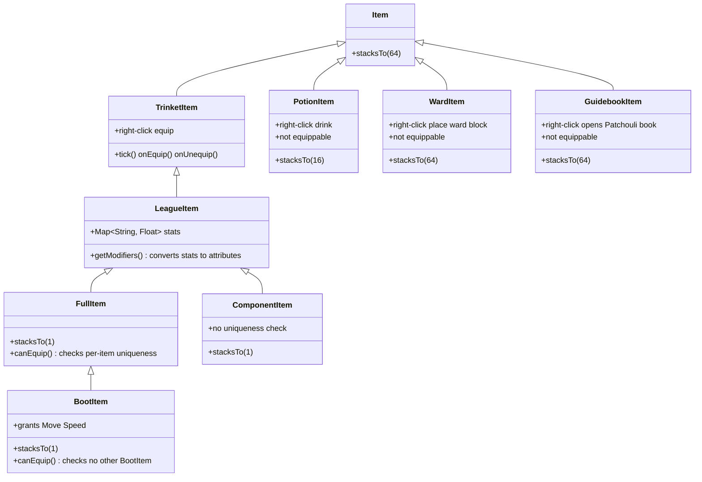

# league-of-crafters

> **Note:** Ward block textures are temporary. Wards use the item texture as a sapling-style cross block model. These will be replaced with dedicated block textures in a future update.

## Items

| Item | Status | Stat Slug |
|------|--------|-----------|
| Abyssal Mask | Draft | `abyssal_mask` |
| Actualizer | Draft | `actualizer` |
| Aether Wisp | Draft | `aether_wisp` |
| Amplifying Tome | Draft | `amplifying_tome` |
| Anathema's Chains | Draft | `anathema_s_chains` |
| Archangel's Staff | Draft | `archangel_s_staff` |
| Ardent Censer | Draft | `ardent_censer` |
| Armored Advance | Draft | `armored_advance` |
| Atma's Reckoning | Draft | `atma_s_reckoning` |
| Axiom Arc | Draft | `axiom_arc` |
| B. F. Sword | Draft | `b_f_sword` |
| Bami's Cinder | Draft | `bami_s_cinder` |
| Bandleglass Mirror | Draft | `bandleglass_mirror` |
| Bandlepipes | Draft | `bandlepipes` |
| Banshee's Veil | Draft | `banshee_s_veil` |
| Bastionbreaker | Draft | `bastionbreaker` |
| Berserker's Greaves | Draft | `berserker_s_greaves` |
| Black Cleaver | Draft | `black_cleaver` |
| Black Mist Scythe | Draft | `black_mist_scythe` |
| Blackfire Torch | Draft | `blackfire_torch` |
| Blade of The Ruined King | Draft | `blade_of_the_ruined_king` |
| Blasting Wand | Draft | `blasting_wand` |
| Blighting Jewel | Draft | `blighting_jewel` |
| Bloodletter's Curse | Draft | `bloodletter_s_curse` |
| Bloodsong | Draft | `bloodsong` |
| Bloodthirster | Draft | `bloodthirster` |
| Boots | Draft | `boots` |
| Boots of Swiftness | Draft | `boots_of_swiftness` |
| Bounty of Worlds | Draft | `bounty_of_worlds` |
| Bramble Vest | Draft | `bramble_vest` |
| Bulwark of the Mountain | Draft | `bulwark_of_the_mountain` |
| Cappa Juice | Draft | `cappa_juice` |
| Catalyst of Aeons | Draft | `catalyst_of_aeons` |
| Caulfield's Warhammer | Draft | `caulfield_s_warhammer` |
| Celestial Opposition | Draft | `celestial_opposition` |
| Chain Vest | Draft | `chain_vest` |
| Chainlaced Crushers | Draft | `chainlaced_crushers` |
| Chalice of Blessing | Draft | `chalice_of_blessing` |
| Chempunk Chainsword | Draft | `chempunk_chainsword` |
| Chemtech Putrifier | Draft | `chemtech_putrifier` |
| Cloak of Agility | Draft | `cloak_of_agility` |
| Cloak of Starry Night | Draft | `cloak_of_starry_night` |
| Cloth Armor | Draft | `cloth_armor` |
| Control Ward | Draft | `control_ward` |
| Corrupting Potion | Draft | `corrupting_potion` |
| Cosmic Drive | Draft | `cosmic_drive` |
| Crimson Lucidity | Draft | `crimson_lucidity` |
| Crown of the Shattered Queen | Draft | `crown_of_the_shattered_queen` |
| Cruelty | Draft | `cruelty` |
| Cryptbloom | Draft | `cryptbloom` |
| Crystalline Bracer | Draft | `crystalline_bracer` |
| Cull | Draft | `cull` |
| Dagger | Draft | `dagger` |
| Dark Seal | Draft | `dark_seal` |
| Dawncore | Draft | `dawncore` |
| Dead Man's Plate | Draft | `dead_man_s_plate` |
| Death's Dance | Draft | `death_s_dance` |
| Deathfire Grasp | Draft | `deathfire_grasp` |
| Demon King's Crown | Draft | `demon_king_s_crown` |
| Demonic Embrace | Draft | `demonic_embrace` |
| Diadem of Songs | Draft | `diadem_of_songs` |
| Divine Sunderer | Draft | `divine_sunderer` |
| Doran's Blade | Draft | `doran_s_blade` |
| Doran's Bow | Draft | `doran_s_bow` |
| Doran's Helm | Draft | `doran_s_helm` |
| Doran's Ring | Draft | `doran_s_ring` |
| Doran's Shield | Draft | `doran_s_shield` |
| Dream Maker | Draft | `dream_maker` |
| Dusk and Dawn | Draft | `dusk_and_dawn` |
| Duskblade of Draktharr | Draft | `duskblade_of_draktharr` |
| Echoes of Helia | Draft | `echoes_of_helia` |
| Eclipse | Draft | `eclipse` |
| Edge of Night | Draft | `edge_of_night` |
| Elixir of Avarice | Draft | `elixir_of_avarice` |
| Elixir of Force | Draft | `elixir_of_force` |
| Elixir of Iron | Draft | `elixir_of_iron` |
| Elixir of Sorcery | Draft | `elixir_of_sorcery` |
| Elixir of Wrath | Draft | `elixir_of_wrath` |
| Emberknife | Draft | `emberknife` |
| Endless Hunger | Draft | `endless_hunger` |
| Essence Reaver | Draft | `essence_reaver` |
| Evenshroud | Draft | `evenshroud` |
| Everfrost | Draft | `everfrost` |
| Executioner's Calling | Draft | `executioner_s_calling` |
| Experimental Hexplate | Draft | `experimental_hexplate` |
| Faerie Charm | Draft | `faerie_charm` |
| Farsight Alteration | Draft | `farsight_alteration` |
| Fated Ashes | Draft | `fated_ashes` |
| Fiendhunter Bolts | Draft | `fiendhunter_bolts` |
| Fiendish Codex | Draft | `fiendish_codex` |
| Fimbulwinter | Draft | `fimbulwinter` |
| Flesheater | Draft | `flesheater` |
| Forbidden Idol | Draft | `forbidden_idol` |
| Force of Nature | Draft | `force_of_nature` |
| Forever Forward | Draft | `forever_forward` |
| Frostfang | Draft | `frostfang` |
| Frozen Heart | Draft | `frozen_heart` |
| Frozen Mallet | Draft | `frozen_mallet` |
| Galeforce | Draft | `galeforce` |
| Gambler's Blade | Draft | `gambler_s_blade` |
| Gargoyle Stoneplate | Draft | `gargoyle_stoneplate` |
| Ghostcrawlers | Draft | `ghostcrawlers` |
| Giant's Belt | Draft | `giant_s_belt` |
| Glacial Buckler | Draft | `glacial_buckler` |
| Glowing Mote | Draft | `glowing_mote` |
| Gluttonous Greaves | Draft | `gluttonous_greaves` |
| Golden Spatula | Draft | `golden_spatula` |
| Goredrinker | Draft | `goredrinker` |
| Guardian Angel | Draft | `guardian_angel` |
| Guardian's Amulet | Draft | `guardian_s_amulet` |
| Guardian's Blade | Draft | `guardian_s_blade` |
| Guardian's Dirk | Draft | `guardian_s_dirk` |
| Guardian's Hammer | Draft | `guardian_s_hammer` |
| Guardian's Horn | Draft | `guardian_s_horn` |
| Guardian's Orb | Draft | `guardian_s_orb` |
| Guardian's Shroud | Draft | `guardian_s_shroud` |
| Guinsoo's Rageblade | Draft | `guinsoo_s_rageblade` |
| Gunmetal Greaves | Draft | `gunmetal_greaves` |
| Gusto | Draft | `gusto` |
| Gustwalker Hatchling | Draft | `gustwalker_hatchling` |
| Hailblade | Draft | `hailblade` |
| Harrowing Crescent | Draft | `harrowing_crescent` |
| Haunting Guise | Draft | `haunting_guise` |
| Health Potion | Draft | `health_potion` |
| Hearthbound Axe | Draft | `hearthbound_axe` |
| Heartsteel | Draft | `heartsteel` |
| Hexdrinker | Draft | `hexdrinker` |
| Hexoptics C44 | Draft | `hexoptics_c44` |
| Hextech Alternator | Draft | `hextech_alternator` |
| Hextech Gunblade | Draft | `hextech_gunblade` |
| Hextech Rocketbelt | Draft | `hextech_rocketbelt` |
| Hollow Radiance | Draft | `hollow_radiance` |
| Horizon Focus | Draft | `horizon_focus` |
| Hubris | Draft | `hubris` |
| Hullbreaker | Draft | `hullbreaker` |
| Iceborn Gauntlet | Draft | `iceborn_gauntlet` |
| Immortal Path | Draft | `immortal_path` |
| Immortal Shieldbow | Draft | `immortal_shieldbow` |
| Imperial Mandate | Draft | `imperial_mandate` |
| Infinity Edge | Draft | `infinity_edge` |
| Innervating Locket | Draft | `innervating_locket` |
| Ionian Boots of Lucidity | Draft | `ionian_boots_of_lucidity` |
| Ironspike Whip | Draft | `ironspike_whip` |
| Jak'Sho, The Protean | Draft | `jak_sho_the_protean` |
| Kaenic Rookern | Draft | `kaenic_rookern` |
| Kalista's Black Spear | Draft | `kalista_s_black_spear` |
| Kindlegem | Draft | `kindlegem` |
| Kircheis Shard | Draft | `kircheis_shard` |
| Knight's Vow | Draft | `knight_s_vow` |
| Kraken Slayer | Draft | `kraken_slayer` |
| Last Whisper | Draft | `last_whisper` |
| Leeching Leer | Draft | `leeching_leer` |
| Liandry's Torment | Draft | `liandry_s_torment` |
| Lich Bane | Draft | `lich_bane` |
| Lifeline | Draft | `lifeline` |
| Lifewell Pendant | Draft | `lifewell_pendant` |
| Lightning Braid | Draft | `lightning_braid` |
| Locket of the Iron Solari | Draft | `locket_of_the_iron_solari` |
| Long Sword | Draft | `long_sword` |
| Lord Dominik's Regards | Draft | `lord_dominik_s_regards` |
| Lost Chapter | Draft | `lost_chapter` |
| Luden's Echo | Draft | `luden_s_echo` |
| Malignance | Draft | `malignance` |
| Manamune | Draft | `manamune` |
| Maw of Malmortius | Draft | `maw_of_malmortius` |
| Mejai's Soulstealer | Draft | `mejai_s_soulstealer` |
| Mercurial Scimitar | Draft | `mercurial_scimitar` |
| Mercury's Treads | Draft | `mercury_s_treads` |
| Mikael's Blessing | Draft | `mikael_s_blessing` |
| Mobility Boots | Draft | `mobility_boots` |
| Moonstone Renewer | Draft | `moonstone_renewer` |
| Morellonomicon | Draft | `morellonomicon` |
| Mortal Reminder | Draft | `mortal_reminder` |
| Mosstomper Seedling | Draft | `mosstomper_seedling` |
| Multitool | Draft | `multitool` |
| Muramana | Draft | `muramana` |
| Nashor's Tooth | Draft | `nashor_s_tooth` |
| Navori Flickerblade | Draft | `navori_flickerblade` |
| Needlessly Large Rod | Draft | `needlessly_large_rod` |
| Negatron Cloak | Draft | `negatron_cloak` |
| Night Harvester | Draft | `night_harvester` |
| Noonquiver | Draft | `noonquiver` |
| Null-Magic Mantle | Draft | `nullmagic_mantle` |
| Oblivion Orb | Draft | `oblivion_orb` |
| Obsidian Edge | Draft | `obsidian_edge` |
| Opportunity | Draft | `opportunity` |
| Oracle Lens | Draft | `oracle_lens` |
| Overcharged | Draft | `overcharged` |
| OvererchargedHA | Draft | `overerchargedha` |
| Overgrowth | Draft | `overgrowth` |
| Overlord's Bloodmail | Draft | `overlord_s_bloodmail` |
| Pauldrons of Whiterock | Draft | `pauldrons_of_whiterock` |
| Penetrating Bullets | Draft | `penetrating_bullets` |
| Phage | Draft | `phage` |
| Phantom Dancer | Draft | `phantom_dancer` |
| Phreakish Gusto | Draft | `phreakish_gusto` |
| Pickaxe | Draft | `pickaxe` |
| Plated Steelcaps | Draft | `plated_steelcaps` |
| Profane Hydra | Draft | `profane_hydra` |
| Protoplasm Harness | Draft | `protoplasm_harness` |
| Prowler's Claw | Draft | `prowler_s_claw` |
| Quicksilver Sash | Draft | `quicksilver_sash` |
| Rabadon's Deathcap | Draft | `rabadon_s_deathcap` |
| Radiant Virtue | Draft | `radiant_virtue` |
| Rageknife | Draft | `rageknife` |
| Randuin's Omen | Draft | `randuin_s_omen` |
| Rapid Firecannon | Draft | `rapid_firecannon` |
| Ravenous Hydra | Draft | `ravenous_hydra` |
| Rectrix | Draft | `rectrix` |
| Recurve Bow | Draft | `recurve_bow` |
| Redemption | Draft | `redemption` |
| Refillable Potion | Draft | `refillable_potion` |
| Reinforced Armor | Draft | `reinforced_armor` |
| Rejuvenation Bead | Draft | `rejuvenation_bead` |
| Relic Shield | Draft | `relic_shield` |
| Riftmaker | Draft | `riftmaker` |
| Rite of Ruin | Draft | `rite_of_ruin` |
| Rod of Ages | Draft | `rod_of_ages` |
| Ruby Crystal | Draft | `ruby_crystal` |
| Runaan's Hurricane | Draft | `runaan_s_hurricane` |
| Runesteel Spaulders | Draft | `runesteel_spaulders` |
| Runic Compass | Draft | `runic_compass` |
| Rylai's Crystal Scepter | Draft | `rylai_s_crystal_scepter` |
| Sapphire Crystal | Draft | `sapphire_crystal` |
| Scarecrow Effigy | Draft | `scarecrow_effigy` |
| Scorchclaw Pup | Draft | `scorchclaw_pup` |
| Scout's Slingshot | Draft | `scout_s_slingshot` |
| Seeker's Armguard | Draft | `seeker_s_armguard` |
| Seraph's Embrace | Draft | `seraph_s_embrace` |
| Serpent's Fang | Draft | `serpent_s_fang` |
| Serrated Dirk | Draft | `serrated_dirk` |
| Serylda's Grudge | Draft | `serylda_s_grudge` |
| Shadowflame | Draft | `shadowflame` |
| Shard of True Ice | Draft | `shard_of_true_ice` |
| Shattered Armguard | Draft | `shattered_armguard` |
| Sheen | Draft | `sheen` |
| Shield of Molten Stone | Draft | `shield_of_molten_stone` |
| Shield of the Rakkor | Draft | `shield_of_the_rakkor` |
| Shurelya's Battlesong | Draft | `shurelya_s_battlesong` |
| Silvermere Dawn | Draft | `silvermere_dawn` |
| Sin Eater | Draft | `sin_eater` |
| Slightly Magical Footwear | Draft | `slightly_magical_footwear` |
| Solstice Sleigh | Draft | `solstice_sleigh` |
| Sorcerer's Shoes | Draft | `sorcerer_s_shoes` |
| Spear of Shojin | Draft | `spear_of_shojin` |
| Spectral Cutlass | Draft | `spectral_cutlass` |
| Spectral Sickle | Draft | `spectral_sickle` |
| Spectre's Cowl | Draft | `spectre_s_cowl` |
| Spellslinger's Shoes | Draft | `spellslinger_s_shoes` |
| Spellthief's Edge | Draft | `spellthief_s_edge` |
| Spirit Visage | Draft | `spirit_visage` |
| Staff of Flowing Water | Draft | `staff_of_flowing_water` |
| Stat Bonus | Draft | `stat_bonus` |
| Statikk Shiv | Draft | `statikk_shiv` |
| Stealth Ward | Draft | `stealth_ward` |
| Steel Shoulderguards | Draft | `steel_shoulderguards` |
| Steel Sigil | Draft | `steel_sigil` |
| Sterak's Gage | Draft | `sterak_s_gage` |
| Stirring Wardstone | Draft | `stirring_wardstone` |
| Stormrazor | Draft | `stormrazor` |
| Stormsurge | Draft | `stormsurge` |
| Stridebreaker | Draft | `stridebreaker` |
| Sundered Sky | Draft | `sundered_sky` |
| Sunfire Aegis | Draft | `sunfire_aegis` |
| Super Mech Armor | Draft | `super_mech_armor` |
| Super Mech Power Field | Draft | `super_mech_power_field` |
| Swiftmarch | Draft | `swiftmarch` |
| Sword of Blossoming Dawn | Draft | `sword_of_blossoming_dawn` |
| Sword of the Divine | Draft | `sword_of_the_divine` |
| Symbiotic Soles | Draft | `symbiotic_soles` |
| Synchronized Souls | Draft | `synchronized_souls` |
| Targon's Buckler | Draft | `targon_s_buckler` |
| Tear of the Goddess | Draft | `tear_of_the_goddess` |
| Terminus | Draft | `terminus` |
| The Brutalizer | Draft | `the_brutalizer` |
| The Collector | Draft | `the_collector` |
| The Golden Spatula | Draft | `the_golden_spatula` |
| Thornmail | Draft | `thornmail` |
| Tiamat | Draft | `tiamat` |
| Titanic Hydra | Draft | `titanic_hydra` |
| Total Biscuit of Everlasting Will | Draft | `total_biscuit_of_everlasting_will` |
| Trailblazer | Draft | `trailblazer` |
| Trinity Force | Draft | `trinity_force` |
| Tunneler | Draft | `tunneler` |
| Twin Mask | Draft | `twin_mask` |
| Umbral Glaive | Draft | `umbral_glaive` |
| Unending Despair | Draft | `unending_despair` |
| Vampiric Scepter | Draft | `vampiric_scepter` |
| Veigar's Talisman of Ascension | Draft | `veigar_s_talisman_of_ascension` |
| Verdant Barrier | Draft | `verdant_barrier` |
| Vigilant Wardstone | Draft | `vigilant_wardstone` |
| Void Immolation | Draft | `void_immolation` |
| Void Staff | Draft | `void_staff` |
| Voltaic Cyclosword | Draft | `voltaic_cyclosword` |
| Warden's Eye | Draft | `warden_s_eye` |
| Warden's Mail | Draft | `warden_s_mail` |
| Warmog's Armor | Draft | `warmog_s_armor` |
| Watchful Wardstone | Draft | `watchful_wardstone` |
| Whispering Circlet | Draft | `whispering_circlet` |
| Winged Moonplate | Draft | `winged_moonplate` |
| Winter's Approach | Draft | `winter_s_approach` |
| Wit's End | Draft | `wit_s_end` |
| Wooglet's Witchcap | Draft | `wooglet_s_witchcap` |
| World Atlas | Draft | `world_atlas` |
| Youmuu's Ghostblade | Draft | `youmuu_s_ghostblade` |
| Your Cut | Draft | `your_cut` |
| Yun Tal Wildarrows | Draft | `yun_tal_wildarrows` |
| Zaz'Zak's Realmspike | Draft | `zaz_zak_s_realmspike` |
| Zeal | Draft | `zeal` |
| Zeke's Convergence | Draft | `zeke_s_convergence` |
| Zephyr | Draft | `zephyr` |
| Zhonya's Hourglass | Draft | `zhonya_s_hourglass` |

## Item Architecture

Items use a class hierarchy rooted in Minecraft's `Item`, with specialization via the Trinkets API and custom League stat conversion:

```mermaid
flowchart TD
    A[New item to register] --> B{Is it a boot?}
    B -->|Yes| C[BootItem]
    B -->|No| D{Is it a completed<br/>& fully-upgraded item?<br/>&#40;depth 3, empty into&#91;&#93;&#41;}
    D -->|Yes| E[FullItem]
    D -->|No| F{Is it a component<br/>or starter item?}
    F -->|Yes| G[ComponentItem]
    F -->|No| H{Is it a consumable<br/>&#40;potion, elixir&#41;?}
    H -->|Yes| I[PotionItem]
    H -->|No| J{Is it a ward or<br/>trinket item?}
    J -->|Yes| K[WardItem]
    J -->|No| L{Is it a meme item,<br/>wardstone, or not<br/>yet classified?}
    L -->|Yes| M[Item &#40;plain&#41;]
    L -->|No| N[Ask the user]
```

### Class breakdown

| Class | Stack | Equippable? | Uniqueness | Used for |
|-------|-------|-------------|------------|----------|
| `LeagueItem` | varies | Yes (trinket) | None | Base class for all equippable LoL items |
| `FullItem` | 1 | Yes (trinket) | Per-item (can't equip 2 of the same) | Completed items (depth 3, empty `into[]`) |
| `BootItem` | 1 | Yes (trinket) | Per-item + cross-boot (can't equip any other boot) | All boots |
| `ComponentItem` | 1 | Yes (trinket) | None | Component items, starter items |
| `PotionItem` | 16 | No | N/A | Consumables (potions, elixirs) |
| `WardItem` | 64 | No | N/A | Wards, trinket items (Stealth Ward, etc.) |
| `GuidebookItem` | 64 | No | N/A | Patchouli guidebook |
| `Item` (plain) | 64 | No | N/A | Meme items, wardstones, unbucketed items |

> **Note:** Most items in the table above are currently registered as plain `Item` (stack 64, no trinket behavior). Only boots (~22), potions (~9), wards (5), and the guidebook have been migrated to their dedicated classes so far. Migration of components → `ComponentItem` and completed items → `FullItem` is ongoing.

For the authoritative classification reference when adding new items, see [`AGENTS.md`](AGENTS.md#item-classification-rules).

## Goals

1. Have all items fully set up with proper controls and tested
2. Active item hotbar HUD — equipped LoL trinket items display as icons above the hotbar (slot 1 above hotbar slot 1, slot 2 above slot 2, etc.) for quick reference
3. Active item keybinds — use equipped active items via Ctrl+[1-6] (configurable), activating the item in the corresponding LoL trinket slot
4. Add randomly spawning camps between forest, plains, and mountain biomes that spawn jungle monsters who all drop a LoL coin
5. Add crafting recipes for all items
6. Look into adding champions as possible boss mobs with their own structures
7. Set up NEI compatibility
8. Set up a Patchouli-based in-game guidebook (like Ars Nouveau's Worn Notebook) that documents all items, recipes, crafting mechanics, and world generation. The book would be a craftable item with JSON-driven categories and entries, and the wiki could be auto-generated from the same Patchouli source files.
9. Add tower or nexus world generation with minions that regularly spawn and push along set paths
10. Add towers that attack players on sight, functioning as defensive structures that must be destroyed to progress

## Setup

For setup instructions, please see the [Fabric Documentation page](https://docs.fabricmc.net/develop/getting-started/creating-a-project#setting-up) related to the IDE that you are using.

## License

This template is available under the CC0 license. Feel free to learn from it and incorporate it in your own projects.
